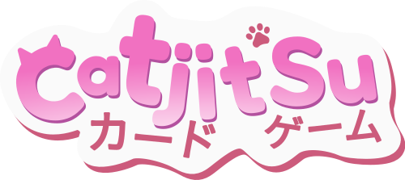
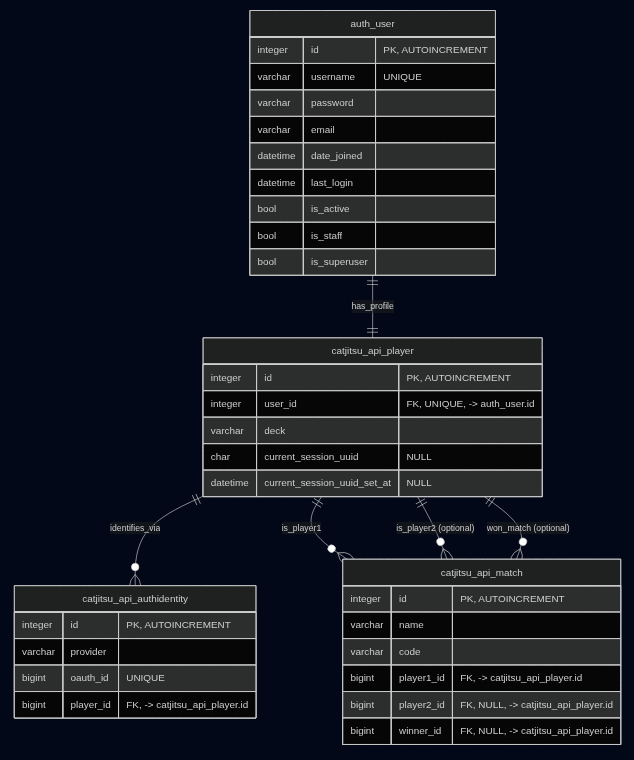

*This project has been created as part of the 42 curriculum by acaro-su, acastrov, gtaza-ca, kde-la-c, ldel-val*

<p align="center">
  
</p>

## Description

Welcome to Catjitsu! A free-to-play card game where you can challenge your friends and defeat your opponents by collecting sets of winning Catjitsu cards!

The rules are simple. Draw 5 cards from your deck, choose a Catjitsu card from your hand, and defeat your rival in a head-to-head elemental battle! Fire, Water, and Snow are your weapons in the dojo, so you must master the elements to achieve glory:

- Fire beats Snow
- Snow beats Water
- Water beats Fire

But remember: if two cards share the same element, only the card with the highest number will remain standing. If both cards have the same value, the round ends in a draw. Let the cats decide your destiny!

Here are some of the key features of this project:

- Single-player card game built with the Godot open-source game engine
- Multiplayer card game featuring private rooms with room codes, powered by WebSockets and a Godot Linux dedicated server
- Player avatar customization and configurable settings
- Backend database and microservices: Django-based backend with database storage and containerized services for the API and dedicated game server.

## Instructions

To play Catjitsu, you first need to deploy the required files on a Linux operating system with an x86_64 architecture using Docker and Docker Compose. Before getting started, make sure your Docker installation is up to date. You can follow this [brief guide](https://dev.to/kingyou/complete-guide-installing-docker-and-docker-compose-step-by-step-24e1) or simply run the following commands in your terminal:

```bash
sudo apt update
curl -fsSL https://get.docker.com -o get-docker.sh
sudo sh get-docker.sh
sudo apt install docker-compose-plugin
```

Once Docker and Docker Compose are installed, clone the repository and run the Makefile, which will take care of both the build process and the deployment.

```bash
git clone https://github.com/luna7111/catjitsu.git
cd catjitsu
make
```

The Makefile executes the following targets in order:

- **make export**: launches a standalone Docker container (not managed by Docker Compose) to build and export the Godot project using Godot 4.7. The generated files are placed in `client/web` and `server/build`.
- **make build**: detects your local network IP address, generates the required certificates for a secure HTTPS connection, and runs `docker compose build` to create the client and server images.
- **make up**: runs `docker compose up` to start all the services.

Once everything is running, you will see an output similar to the following:

```text
[...]
Catjitsu is configured for:
https://<local_network_ip_address>:8443
Host IP: <local_network_ip_address>
[...]
```

Open `https://<local_network_ip_address>:8443` in the web browser of any device connected to your local network (yes, even a smartphone!) and have fun!

## Team Information

Meet the CatJitsu development team! We are a group of programming students from [42 Telefónica](https://www.fundaciontelefonica.com/campus-42/).

- **acaro-su** — **Developer**  
  Responsible for code reviews, quality assurance and frontend development.

- **acastrov** — **Project Manager, Developer**  
  Responsible for project planning, multiplayer and frontend development, deployment architecture and the game's soundtrack.

- **gtaza-ca** — **Developer**  
  Responsible for backend development, code reviews and quality assurance.

- **kde-la-c** — **Technical Lead, Developer**  
  Responsible for the project's technical architecture, backend development and deployment infrastructure.

- **ldel-val** — **Product Owner, Developer**  
  Responsible for product planning, frontend and backend development, deployment architecture and the game's graphics and artwork.

## Project Management

During our first team meetings, we decided to divide the project into two main areas:

- **Frontend (Game Experience and Multiplayer):** responsible for developing the game in Godot and delivering a smooth multiplayer experience.
- **Backend (User Database, Authentication, and Security):** responsible for building a robust backend, managing user data, and implementing user registration and authentication through OAuth.

Once the team was divided into these two areas, we started organizing our work using GitHub Issues to track tasks and development milestones. We adopted a Git Flow workflow, creating a dedicated branch for every new feature before merging it into the main project.

Throughout the development process, we maintained continuous communication using instant messaging applications such as WhatsApp and Slack, while holding regular online meetings through Discord to discuss progress, resolve blockers, and coordinate the integration of each component.

## Technical Stack

For the frontend, we decided to develop a fully featured multiplayer card game that runs directly in modern web browsers. To achieve this, we chose **Godot**, an open-source game engine that provides all the tools needed to build a 2D card game from the ground up.

In addition to its game development features, Godot includes a High-Level Multiplayer API, which greatly simplifies the implementation of multiplayer systems. To handle real-time communication between players, we chose **WebSockets** as the networking protocol, with a dedicated multiplayer server also developed in Godot.

For the backend, we chose **Django** as the main web framework. It provides the REST API used by the web client to handle server-side functionality and persistent application data. Django's structure also allows us to separate the backend logic from the game server, keeping responsibilities clearly divided between the web API and the real-time multiplayer service.

The backend is containerized using **Docker**, with the different services running independently and communicating through the appropriate network protocols. This architecture makes the application easier to deploy and maintain while allowing the game server and web API to scale or evolve independently.

## Database Schema

<p align="center">
  
</p>

## Features List

- **Full single-player experience:** battle against an AI opponent.
- **Full multiplayer experience:** challenge your friends in exciting Catjitsu matches.
- **Private room lobbies:** quickly create and join games using room codes on the same network.
- **Avatar customization:** choose from a collection of adorable 3D cat avatars.
- **Multiple language support:** play the game in English, Spanish, or French.
- **Accessibility options:** screen reader support, keyboard navigation, and assistive technologies.
- **Multiple input methods:** play using a mouse, keyboard, or controller.
- **Containerized backend services**: Django API and supporting services can be deployed independently using Docker
- **Stored player data**: store and manage player accounts, profiles, and game-related data through the backend.

## Modules

### Web

#### Major

- **Use a framework for both the frontend and backend** [acaro-su, acastrov, gtaza-ca, kde-la-c, ldel-val]: Godot Engine is used as the frontend framework for the game, while Django is used as the backend framework for the API and server-side functionality.
- **Implement real-time features using WebSockets or similar technology** [acaro-su, acastrov]: Real-time multiplayer communication using WebSockets through Godot's High-Level Multiplayer API.
- **A public API to interact with the database with a secured API key, rate limiting, documentation, and at least 5 endpoints** [gtaza-ca, kde-la-c, ldel-val]:The project includes a Django REST API that provides controlled access to persistent application data through multiple endpoints. API access is protected through authentication mechanisms, with rate limiting applied to prevent abuse. The API is documented to make its endpoints and expected requests easier to understand and consume.

#### Minor

- **Custom-made design system with reusable components, including a proper color palette, typography, and icons (minimum: 10 reusable components)** [ldel-val]: A custom Godot Theme is used to provide a consistent visual design across the game, defining shared colors, typography, and styling for UI controls. The theme is reused across multiple interface components such as buttons, panels, labels, input fields, menus, and other game UI elements.

---

### Accessibility and Internationalization

#### Major

- **Complete accessibility compliance (WCAG 2.1 AA) with screen reader support, keyboard navigation, and assistive technologies** [ldel-val, gtaza-ca]: Screen reader support, keyboard navigation, controller support, and the use of the OpenDyslexic font.

#### Minor

- **Support for multiple languages (at least 3 languages)** [gtaza-ca, kde-la-c, ldel-val]: Support for English, French, and Spanish through Godot's internationalization (i18n) system.
- **Support for additional browsers** [acastrov, ldel-val]: Compatibility with Google Chrome, Mozilla Firefox.

---

### Artificial Intelligence

#### Major

- **Introduce an AI Opponent for games** [acastrov, ldel-val]: The opponent uses a deterministic decision-making system with controlled variation. Its actions are selected according to the current game state and available cards, giving it consistent behavior while introducing enough randomness to prevent every match from playing out identically.

---

### Gaming and User Experience

#### Major

- **Implement a complete web-based game where users can play against each other** [acaro-su, acastrov, ldel-val]: Complete multiplayer gameplay implemented with Godot's frontend and High-Level Multiplayer API over WebSockets.
- **Remote players — Enable two players on separate computers to play the same game in real-time** [acaro-su, acastrov]: Room-based multiplayer system allowing two players on different computers to play in real time over the same local network.
- **Implement advanced 3D graphics using a library like Three.js or Babylon.js** [ldel-val]: CatJitsu uses Godot's 3D engine to create and render the game's cat-themed 3D environments, characters, animations, and visual effects, providing an interactive 3D experience rather than relying on a purely 2D interface.
---

## Point Calculation

- **Major modules:** 9 (18 points)
- **Minor modules:** 3 (3 points)

**Total:** **21 points**

## Individual Contributions

- **acaro-su:** Frontend development, multiplayer implementation, code reviews, and quality assurance.

- **acastrov:** Project management, gameplay programming, multiplayer systems, WebSockets integration, deployment architecture, and build automation.

- **gtaza-ca:** Backend development, database integration, REST API development, authentication, accessibility features, and quality assurance.

- **kde-la-c:** Technical leadership, backend architecture, API design, deployment architecture, authentication, and infrastructure.

- **ldel-val:** Product ownership, frontend and backend development, UI/UX design, 3D assets and graphics, accessibility, internationalization, and gameplay design.

## Resources

### Frontend
#### Documentation
- [Godot Docs](https://docs.godotengine.org/en/stable/#)
- [Exporting for the Web - Godot Docs](https://docs.godotengine.org/en/stable/tutorials/export/exporting_for_web.html)
  
#### Tutorials
- [Card Game Godot 4.3 COMPLETE TUTORIAL - Barry's Dev Hell (playlist)](https://www.youtube.com/playlist?list=PLNWIwxsLZ-LMYzxHlVb7v5Xo5KaUV7Tq1)
- [Dedicated Multiplayer - Game Development Center (playlist)](https://www.youtube.com/playlist?list=PLZ-54sd-DMAKU8Neo5KsVmq8KtoDkfi4s)

#### Videos
- [Godot Multiplayer Tutorial: The Quick and Easy High-Level API - IcyEngine](https://www.youtube.com/watch?v=YnfsyZJRsL8)

### Backend
#### Articles
- [WebSocket and Its Difference from HTTP](https://www.geeksforgeeks.org/web-tech/what-is-web-socket-and-how-it-is-different-from-the-http/)
- [WebSocket Explained: What It Is and How It WorksWebSocket Explained: What It Is and How It Works](https://medium.com/@omargoher/websocket-explained-what-it-is-and-how-it-works-b9eafefe28d7)
#### Documentation
- [RFC 6455 - The WebSocket Protocol](https://datatracker.ietf.org/doc/html/rfc6455)
- [MDN - WebSocket](https://developer.mozilla.org/en-US/docs/Web/API/WebSocket)
- [Godot Docs - Using WebSockets](https://docs.godotengine.org/en/stable/tutorials/networking/websocket.html)
- [Django Docs](https://docs.djangoproject.com/en/6.1/)
- [Data Rest Framework Authentication Docs](https://www.django-rest-framework.org/api-guide/authentication/)
#### Videos
- [Godot High Level Multiplayer and WebSockets connection - Davies dev](https://www.youtube.com/watch?v=RQKodnluOp8&list=PLylNHWOqRhsGCmeOcKOPnbMRKSNqqQycM)
- [Docker + Django: Containerize the Right Way with Nginx, Postgresql & Gunicorn](https://www.youtube.com/watch?v=1v3lqIITRJA)
- [Django REST Framework - Build an API from Scratch](https://www.youtube.com/watch?v=i5JykvxUk_A)

### AI Usage

We tried to keep AI usage to a minimum in order to strengthen our programming skills and critical thinking. At the same time, we recognize that AI is a valuable tool that, when used responsibly, can improve productivity and accelerate development.

Throughout the project, we aimed to strike a balance between the practical benefits of AI and its ethical implications. We are aware of the ongoing discussions surrounding its environmental impact, its effects on creative industries, and the unresolved legal questions regarding copyright and training data. These topics continue to evolve and deserve careful consideration.

For this reason, we limited AI assistance to technical and documentation-related tasks, including:

- Researching information about frontend and backend deployment, as well as the technologies used in this project (Godot, Django, Docker, WebSockets, etc.).
- Reviewing and refactoring code during different stages of development.
- Assisting with small, well-defined pieces of code, particularly for deployment scripts and parts of the WebSocket networking architecture.
- Improving English spelling, grammar, and technical documentation.

No AI-generated assets were used in the production of the game's artwork, graphics, music, or sound effects. Every visual and audio asset included in Catjitsu was created or selected by the team without the use of generative AI.